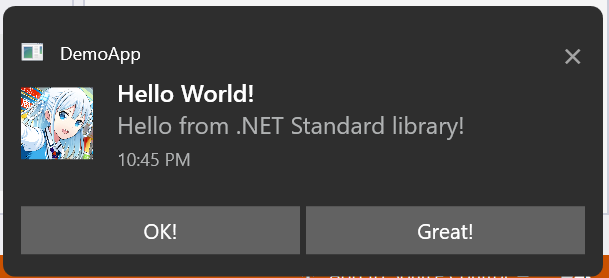

# Dynamic ToastNotification for WPF

## Intro
This project is
- A simple re-implementation of Windows 10's Toast Notifications for .NET Core and .NET Framework, and of course, .NET 5+
- A crazy attempt to distribute WPF controls in a .NET Standard 2.0 Library
- An experimental feature which will soon be incorporated in the `ToastNotification.Uno` library.

## Details
- I could have used Hardcodet's HNotifyIcon library, however, it's not under a free license, so I wrote this.
- The notifications mimick Windows 10's notification, but with rounded corners (this seems to be a trend in Windows 11, and common in Windows 7, too).
- Notifications are place properly on the bottom right corner of the screen, and honors the Taskbar's position.
- The notifications here do NOT linger in the Action Center, and do NOT play sounds when activiated.

## License
This project is licensed under [The Root License](https://github.com/trungnt2910/RootLicense/blob/master/LICENSE.md).